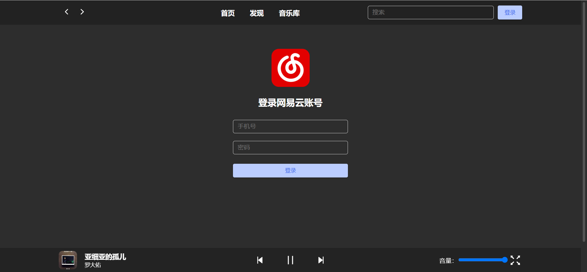
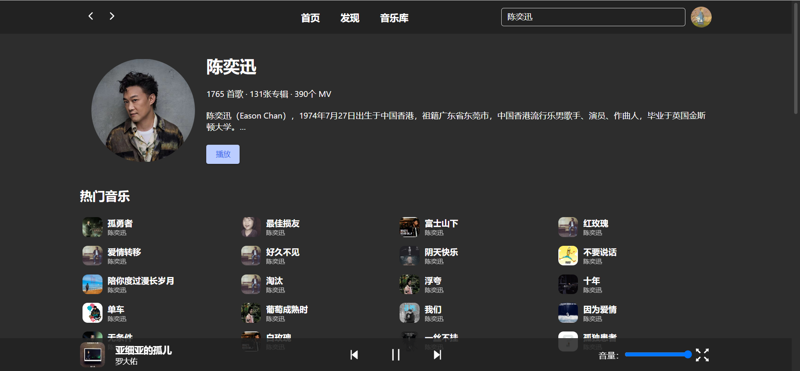
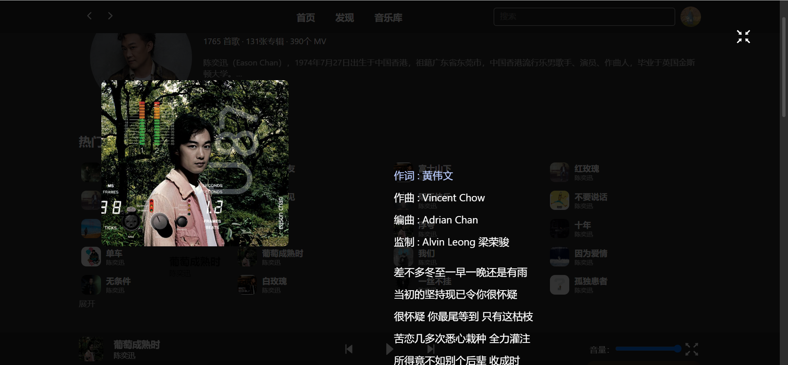

# 一个仿音乐软件

仿 Github 中的 [YesPlayMusic](https://github.com/qier222/YesPlayMusic) 开源项目进行编写，项目全部使用 **styled-components** 自己开发样式组件，包括歌词滚动、底部播放器组件等。

后端数据采用 [NeteaseCloudMusicApi](https://github.com/Binaryify/NeteaseCloudMusicApi) 提供的服务。

（注意：因为 API 提供的服务有时候并不稳定，会造成有时候登录不进去）

## 启动

```bash
yarn # 安装依赖包

yarn start # 启动 Web 端
```

## 使用的库

说一下用到了那些库吧

- styled-components（需要安装 @types/styled-components）
- react-router-dom（需安装 @types/react-router-dom）
- mobx 与 mobx-react-lite
- axios
- js-cookie（需要安装 @types/js-cookie）
- dayjs

## Features

- 基本音乐软件功能
- 全屏歌词滚动
- 底部播放器组件
- 虚拟列表（VList 组件，目前应用到歌单列表中）
- 自定义 Button 组件
- 自定义 Input 组件（onChange 默认有防抖功能）
- 自定义 LazyLoadImg 组件（图片懒加载）

## TODO

- Message 组件
- Dialog 组件
- 个人页面（专辑等）
- 歌单显示中搞点搜索？
- 再加一个“回到顶部”的组件

## 项目部分截图

> 以下部分 UI 可能还会更改

首页


发现


登录界面



音乐库（需要已登录才能访问）


搜索页面


歌手介绍



全屏歌词滚动


